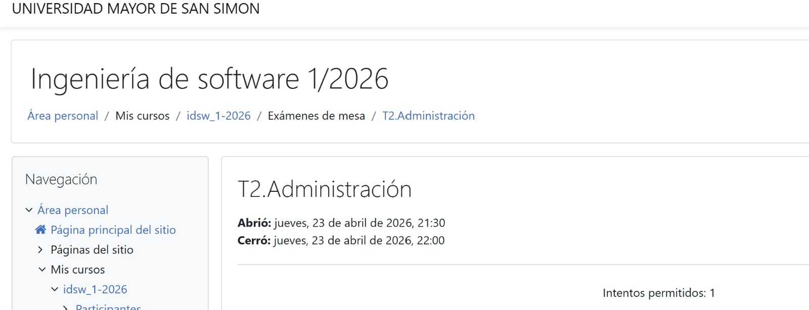

<table>
  <tr>
    <td width="160" valign="middle">
      
    </td>
    <td valign="middle">
           <h1 align="left">📘 Apuntes de Git</h1>
           <h3 align="left">🚀 Ingeniería de Sistemas</h3>
    </td>
  </tr>
</table>

| 📬 **Contacto** | |
| --- | --- |
| **Nombre** | Darlyn Alejandra Veliz Mamani |
| **Celular** | 77433898 |
| **Correo** | darlinalejandra87@gmail.com |

---

# 📚 Resumen de clases

## 📖 Clase 1 – Introducción a Git

### ❓ ¿Qué es Git?
Git es un sistema de control de versiones que guarda el historial de tus archivos y te permite trabajar con ramas sin perder cambios.

### 💡 ¿Por qué usar Git?
| Ventaja | Descripción |
| --- | --- |
| Control de versiones | Guarda el historial y te permite volver atrás. |
| Seguridad | Evita perder trabajo importante. |
| Trabajo en equipo | Permite colaborar sin sobrescribir cambios ajenos. |

### Instalar y configurar Git
```bash
git config --global user.name "Tu Nombre"
git config --global user.email "tu@email.com"
```

---

## 📝 Clase 2 – Guardar y restaurar cambios

### 🧩 Comandos básicos
| Comando | Qué hace |
| --- | --- |
| `git add .` | Prepara todos los cambios para el siguiente commit |
| `git restore <archivo>` | Restaura un archivo al estado anterior |
| `git reset` | Quita cambios de la zona de preparación (staging) |

### ✨ Buenas prácticas de commits
- Usa mensajes claros, precisos y descriptivos.
- Si trabajas en equipo, escribe commits en inglés.
- Divide los cambios en commits pequeños y coherentes.

---

## 🌐 Clase 3 – Crear cuenta y repositorio en GitHub

### Crear una cuenta en GitHub
- Busca GitHub en el navegador.
- Regístrate con una cuenta normal.
- Configura tu nombre y correo.

### Crear un repositorio nuevo
- Inicia sesión en GitHub.
- Haz clic en "New" o "Nuevo repositorio".
- Escribe el nombre del repo.
- Agrega una descripción opcional.
- Elige público o privado.
- Activa la opción de README si quieres iniciar con un archivo.
- Haz clic en "Create repository".

### Comandos básicos de Git
- Crear y cambiar de rama: `git checkout -b nueva-funcion`
- Clonar un repositorio: `git clone <url-del-repositorio>`
- Subir cambios: `git push`
- Traer cambios: `git pull`

---

## 📘 Clase 4 – Git Remote, SSH y manejo de múltiples cuentas

### 📌 Evidencia y justificación

<table>
  <tr>
    <td width="55%" valign="top">
      **Justificación**  
      No pude asistir a la clase ese día por motivo de examen de la materia de Ingeniería de Software, por lo cual adjunto la imagen del examen en Moodle. También después teníamos una reunión para revisión con QAs sobre el sprint 2.
    </td>
    <td width="45%" valign="top">
      
    </td>
  </tr>
</table>

### ✍️ Apuntes de la clase 4
En esta clase aprendí cómo conectar mi repositorio local con GitHub y cómo manejar esas conexiones, especialmente cuando tengo más de una cuenta.

#### 🔧 Git Remote
- `git remote` permite gestionar las conexiones con repositorios remotos.
- Con esto le digo a mi Git local a dónde enviar los cambios o de dónde traerlos.

#### ✅ Comandos importantes de `git remote`
- `git remote -v` — muestra la URL a la que está conectado el repositorio.
- `git remote add origin "URL"` — vincula el repositorio local con uno remoto.
- `git remote set-url origin "URL"` — cambia la URL remota del repositorio.

#### 🔐 SSH y llaves
SSH es la conexión segura que evita usar usuario y contraseña todo el tiempo. Funciona con llaves que se generan en mi equipo.

- Una llave SSH es una clave única que se guarda en mi computadora.
- GitHub guarda la copia pública y reconoce mi equipo automáticamente.

#### 🌍 Múltiples cuentas en GitHub
Cuando tengo más de una cuenta, Git puede confundirse si no uso llaves diferentes.
- Cada cuenta debe tener su propia llave SSH.
- Se usa un archivo `config` para decirle a Git qué llave usar según el proyecto.

### 🧩 Ejemplos de comandos
| Comando | Uso | Comando | Uso |
| --- | --- | --- | --- |
| `git remote -v` | Ver URLs remotas | `ssh -T git@github.com` | Probar conexión SSH estándar |
| `git remote add origin "URL"` | Conectar repo local a remoto | `ssh -T git@github-personal` | Probar conexión SSH personalizada |
| `git remote set-url origin "URL"` | Cambiar URL remota | `ssh-keygen -t ed25519 -C "correo"` | Generar llave SSH |
| `ssh-keygen -t ed25519 -C "correo" -f ~/.ssh/id-auxi` | Generar llave para otra cuenta | `touch config` | Crear archivo `config` para múltiples cuentas |

---

## 🌿 Clase 5 – Ramas en Git

### ¿Qué es una rama?
Una rama es un camino independiente para trabajar sin afectar el principal.

### Ramas principales
- `main`: rama principal y estable.
- `develop`: rama de desarrollo y pruebas antes de pasar a `main`.

### Trabajar con ramas
- Crear una rama: `git branch <nombre-rama>`.
- Crear y cambiar de rama: `git checkout -b <nombre-rama>`.
- Cambiar de rama: `git checkout <nombre-rama>` o `git switch <nombre-rama>`.
- Eliminar una rama: `git branch -d <nombre-rama>`.

### Flujo recomendado
1. Trabaja en `develop` o en una rama nueva.
2. Prueba los cambios.
3. Cuando estén listos, únelos a la rama principal con `merge`.

---

## 🔀 Clase 6 – Merge, historial y conflictos

### Historias de commits
Ver el historial en forma de gráfico:
```bash
git log --graph --oneline --all
```

### Merge (fusionar ramas)
Merge significa unir el trabajo de una rama a otra.

Ejemplo:
```bash
git checkout develop
git merge nombre-rama
```

### Actualizar antes de trabajar
```bash
git fetch
git pull origin develop
```

### Resolver conflictos
1. Edita los archivos con conflicto.
2. Guarda los cambios.
3. Prepara y crea el commit:
```bash
git add .
git commit
```

### Comandos útiles
- `git remote -v` : muestra los repositorios remotos.
- `git config --list` : muestra la configuración de Git.
- `git config user.name "Mi Nombre"`
- `git config user.email "miemail@gmail.com"`

---

## 🚀 Clase 7 – Pull Request y trabajo colaborativo

### ¿Qué es un Pull Request?
Un Pull Request (PR) es una solicitud para unir el código de tu rama al proyecto principal. Sirve para que el equipo revise y apruebe antes de fusionar.

### Ventajas del Pull Request
- Revisión de código.
- Comentarios y discusión.
- Menos errores al unir cambios.
- Control y seguridad en el proyecto.

### Cómo crear un Pull Request
1. Sube tu rama al repositorio remoto:
```bash
git push origin <rama>
```
2. En GitHub, selecciona la rama.
3. Crea el Pull Request indicando de dónde a dónde se fusiona.

### Flujo recomendado
1. `git checkout develop`
2. `git fetch`
3. `git pull origin develop`
4. `git checkout -b <rama>` o `git checkout <rama>`
5. Trabaja y guarda cambios.
6. `git push origin <rama>`
7. Si es la primera vez: `git push -u origin <rama>`
8. Actualiza tu rama si hubo cambios en `develop`:
```bash
git checkout develop
git fetch
git checkout <rama>
git merge develop
```
9. Si hay conflictos, resuélvelos, luego `git push origin <rama>`.

---


## 🌟 Última clase – Apunte final

### 📍 Lo que aprendimos
En la última clase repasamos el flujo completo de trabajo con GitHub, reforzamos el uso de Pull Requests y revisamos buenas prácticas para mantener el repositorio seguro y organizado.

### 🧩 Puntos más importantes
- Confirmar siempre que la rama `develop` esté actualizada antes de trabajar.
- Usar Pull Requests para revisar cambios antes de unirlos.
- Mantener ramas limpias y eliminar las que ya no se usan.
- Probar las conexiones SSH y asegurar varias cuentas si las necesitas.

### 📦 Comandos y ejemplos
<table>
  <tr>
    <td width="48%" style="border: 2px solid #4CAF50; border-radius: 12px; padding: 14px; vertical-align: top;">
      <strong>Trabajo con ramas</strong>
      <pre><code>git checkout -b nueva-rama
git checkout develop
git merge nueva-rama</code></pre>
    </td>
    <td width="48%" style="border: 2px solid #4CAF50; border-radius: 12px; padding: 14px; vertical-align: top;">
      <strong>Pull Request</strong>
      <pre><code>git push origin nueva-rama
git pull origin develop
git push -u origin nueva-rama</code></pre>
    </td>
  </tr>
  <tr>
    <td width="48%" style="border: 2px solid #4CAF50; border-radius: 12px; padding: 14px; vertical-align: top;">
      <strong>SSH y seguridad</strong>
      <pre><code>ssh-keygen -t ed25519 -C "correo"
ssh -T git@github.com
ssh -T git@github-personal</code></pre>
    </td>
    <td width="48%" style="border: 2px solid #4CAF50; border-radius: 12px; padding: 14px; vertical-align: top;">
      <strong>Configuración de remoto</strong>
      <pre><code>git remote -v
git remote add origin "URL"
git remote set-url origin "URL"</code></pre>
    </td>
  </tr>
</table>

---

## 🔐 Proteger el repositorio

Para mantener el repositorio seguro y ordenado, GitHub permite:
- Bloquear merges directos a `develop` o `main`.
- Obligar a usar Pull Requests.
- Exigir revisiones antes de aprobar cambios.

Esto ayuda a evitar errores y a que el código pase por revisión antes de unirse.

---

## 🙋‍♂️ ¿Cómo colaborar si no soy colaborador invitado?

Aunque no estés invitado directamente, puedes contribuir así:
- Hacer un fork del repositorio.
- Trabajar en tu propio repositorio.
- Enviar un Pull Request al repositorio original.

---

